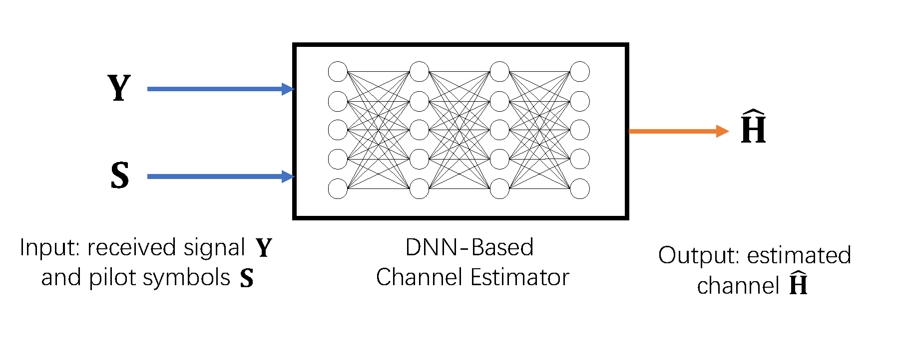
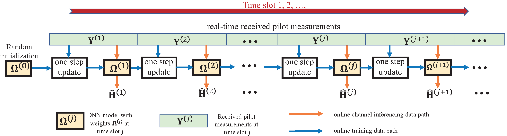

# Online DNN for Massive MIMO Channel Estimation
This repository contains the source codes of the paper "Online deep neural networks for mmWave massive MIMO channel estimation with arbitrary array geometry", which is published in IEEE Transactions on Signal Processing (see https://ieeexplore.ieee.org/abstract/document/9388923).

In this paper, we propose an online training framework for mmWave Massive MIMO channel estimation (CE) with limited pilots, where the training is based on real-time received pilot samples from the base station without requiring knowledge of the true channel. The channel estimator is a fully connected neuron network that takes the real-time pilot measurements as input and output channel estimate based on its current weights. 

The DNN is trained on real-time pilot measurements for CE. (In the figure, we used a mini-batch size of 1 to illustrate the online training algorithm in a timeline.)

# Introduction of the codes
Run "LowRank.py" to implement the proposed algorithm.
"DNNLowRankBlks.py" contains useful functions to implement the online training.

# Note
You may cite us by
@ARTICLE{9388923,
  author={Zheng, Xuanyu and Lau, Vincent K. N.},
  journal={IEEE Transactions on Signal Processing}, 
  title={Online Deep Neural Networks for MmWave Massive MIMO Channel Estimation With Arbitrary Array Geometry}, 
  year={2021},
  volume={69},
  pages={2010-2025},
  doi={10.1109/TSP.2021.3068568}}
